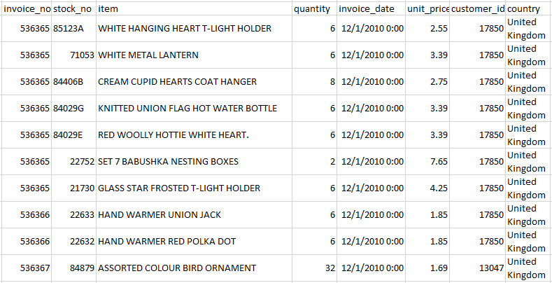
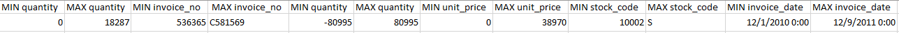
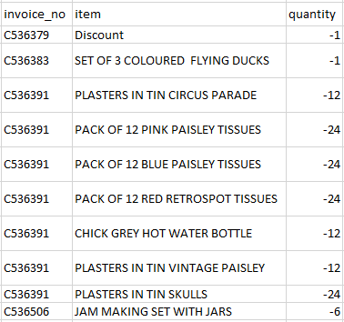
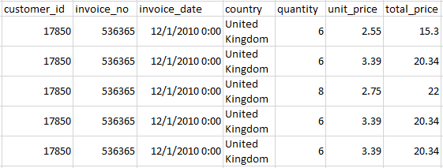
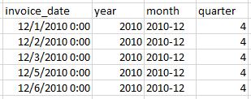
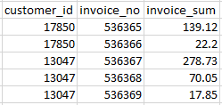
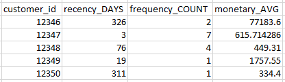
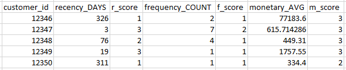
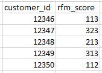
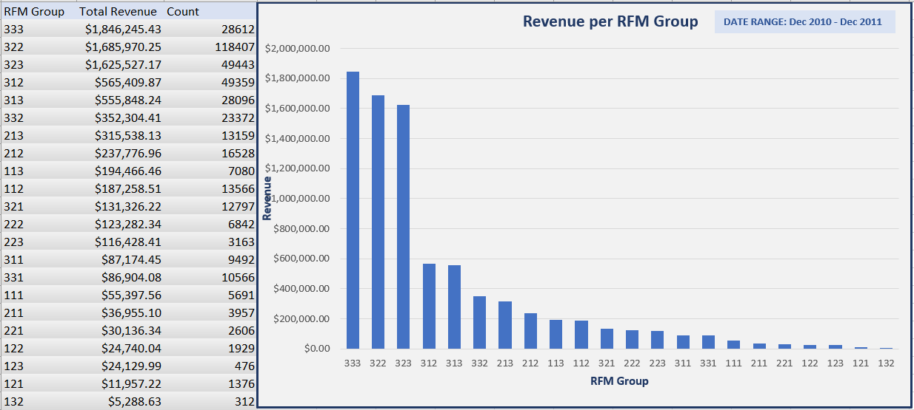

# RFM_Scores
Through MYSQL, this e-commerce company can segment its customers using RFM scores and can write simple queries to get lists of customer IDs. 

## Create database and load data
```
CREATE DATABASE e_commerce;
USE e_commerce;
CREATE TABLE invoice (
	invoice_no varchar(100),
    stock_code varchar(64),
    item varchar(64),
    quantity INT,
    invoice_date TIMESTAMP,
    unit_price DECIMAL(10,2),
	customer_id INT,
    country varchar(32)
);

SET GLOBAL local_infile=1;

LOAD DATA  INFILE 'C:/ProgramData/MySQL/MySQL Server 8.0/Uploads/e_commerce_data.txt'
INTO TABLE invoice
CHARACTER SET latin1
fields terminated by '	'
lines terminated by '\r\n'
ignore 1 lines;

SELECT * FROM invoice
LIMIT 10;
```



* find min and max of some columns to see if any values might not be valid
```
SELECT min(customer_id), 
max(customer_id), 
min(invoice_no),
max(invoice_no),
min(quantity), 
max(quantity), 
min(unit_price), 
max(unit_price),
min(stock_code),
max(stock_code),
min(invoice_date),
max(invoice_date)
FROM invoice;
```



**NOTES:**
* customer_id shouldn't be 0
* max invoice number is unique
* min/max quantity are same, see top and bottom 20
* there are a wide variety of stock_code but they won't RFM score?
* date range 2010-12-01 through 2011-12-09 

## Data Cleaning
*non-existing customer_id were set to 0 using EXCEL*

* invoice_no starting with **C% denotes a returned item**
```
SELECT invoice_no, item, quantity
FROM invoice
WHERE invoice_no LIKE 'C%'
LIMIT 10;
```



```
SELECT invoice_no, quantity
FROM invoice
WHERE invoice_no LIKE 'C%'
AND quantity > 0;
```
*0 records returned*

* invoice_no starting with **A% denotes 'Adjust bad payment'**

```
SELECT *
FROM invoice
WHERE invoice_no LIKE 'A%';

DELETE FROM invoice
WHERE invoice_no LIKE 'A%';
```

* update country names

```
SELECT DISTINCT country
FROM invoice;

UPDATE invoice
SET country = 'Republic of South Africa'
WHERE country = 'RSA';

UPDATE invoice
SET country = 'Ireland'
WHERE country = 'EIRE';
```

## Create Views for query

* Create View to include total_price

```
CREATE VIEW invoice_calc AS
(SELECT customer_id, 
	invoice_no, 
    invoice_date, 
    country, 
    quantity, 
    unit_price, 
    (quantity * unit_price) AS total_price
FROM invoice);

SELECT * FROM invoice_calc
LIMIT 5;
```


* create date table for easier queries from invoice_date column

```
CREATE VIEW date AS
(SELECT DISTINCT invoice_date, 
	YEAR(invoice_date) AS year,
    CONCAT(YEAR(invoice_date), '-', MONTH(invoice_date)) AS month,
    QUARTER(invoice_date) AS quarter
FROM invoice);

SELECT * FROM date
LIMIT 5;
```


* Create view for total purchase price per invoice

```
CREATE VIEW invoice_purchase AS
(SELECT customer_id, invoice_no, SUM(total_price) AS invoice_sum
FROM invoice_calc
GROUP BY customer_id, invoice_no);

SELECT * FROM invoice_purchase
LIMIT 5;
```




* Remaining invoices only start with 'C%' (returns) or '5%' (purchases)
```
SELECT invoice_no FROM invoice
WHERE invoice_no NOT LIKE 'C%'
AND invoice_no NOT LIKE '5%'
ORDER BY invoice_no desc;
```
*no records returned*


## Create Views calculating RFM 

* Create a VIEW for recency, frequency, and monetary values
```
CREATE VIEW rfm AS
(SELECT c.customer_id, 
	DATEDIFF('2011-12-10', MAX(c.invoice_date)) AS recency_DAYS, 
	COUNT(DISTINCT c.invoice_no) AS frequency_COUNT, 
	AVG(p.invoice_sum) AS monetary_AVG
FROM invoice_calc AS c
INNER JOIN invoice_purchase AS p
ON c.customer_id = p.customer_id
WHERE c.customer_id <> 0
AND p.invoice_no LIKE '5%'
GROUP BY c.customer_id);

SELECT * FROM rfm
LIMIT 5;
```



* Generate view for individual rfm scores.
```
CREATE VIEW rfm_values AS
(SELECT customer_id,
	recency_DAYS,
CASE
    WHEN recency_DAYS < 60 THEN 3
    WHEN recency_DAYS < 150 THEN 2
    ELSE 1
END AS r_score,
    frequency_COUNT,
CASE
    WHEN frequency_COUNT > 30 THEN 3
    WHEN frequency_COUNT > 5 THEN 2
    ELSE 1
END AS f_score,
    monetary_AVG,
CASE
    WHEN monetary_AVG > 400 THEN 3
    WHEN monetary_AVG > 150 THEN 2
    ELSE 1
END AS m_score
FROM rfm); 

SELECT * FROM rfm_values
LIMIT 5;
```



* Concatenate rfm_score for each customer_id.
```
CREATE VIEW rfm_scores AS
(SELECT customer_id, CONCAT(r_score, f_score, m_score) AS rfm_score
FROM rfm_values);

SELECT * FROM rfm_scores
LIMIT 5;
```



-------------------------------

* View customer distribution and revenue grouped by rfm_scores
```
SELECT rfm_score, COUNT(rfm_score) 
FROM rfm_scores
GROUP BY rfm_score
ORDER BY rfm_score DESC;
```



